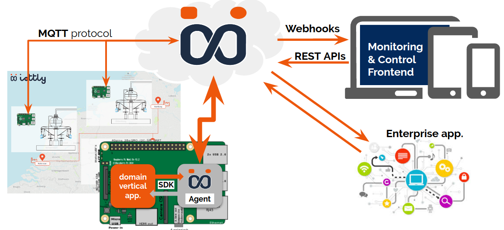
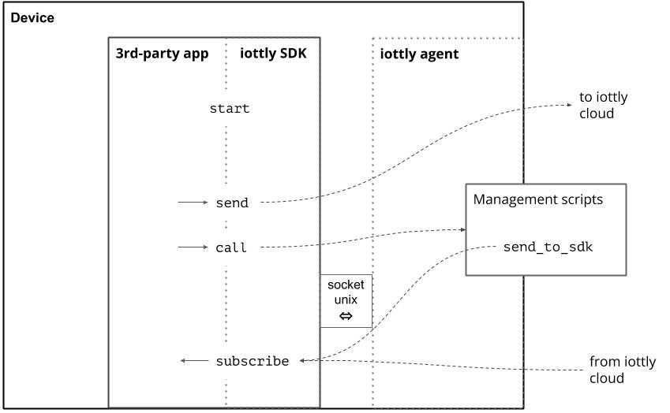

Python SDK iottly
======================================

Python module handling interaction with the `iottly
<https://iottly.com/>`_ agent from third-party applications installed locally on the device.

For example the custom application takes care of the interactions with the
low level hardware and buses, while delegating to the iottly Agent the secure
communication over MQTT.

Moreover the custom application can invoke python scripts registered in the Agent
to perform tasks like complex event detection and correlations. This is like
"functions as a service on embedded devices", and turns out to be particularly
useful if the rules must be updated frequently or different versions of the rules
must be maintained for devices in different installations.

|

Briefly, the registered app can:

    - Send messages to iottly
    - Subscribe to specifics commands received from the iottly-agent
    - Call a Python snippet in the user-defined scripts of the attached Agent
    - Register callbacks on specifics iottly-agent notification

|

How it works:

|

Example snippet:

.. literalinclude:: myfirstiottlyapp.py

|

.. toctree::
    :caption: Table of Contents
    :maxdepth: 1

    installation
    API
    porting
    changelog
